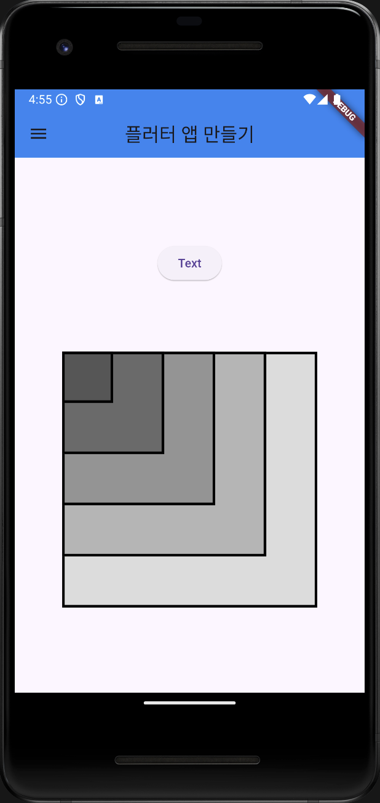
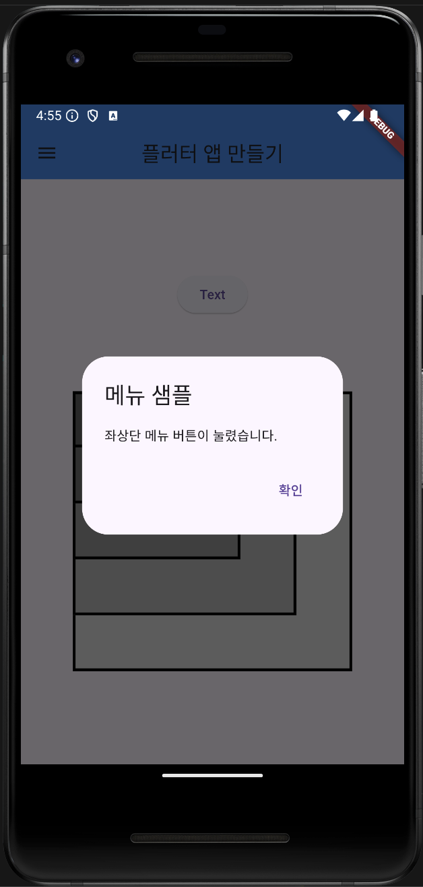
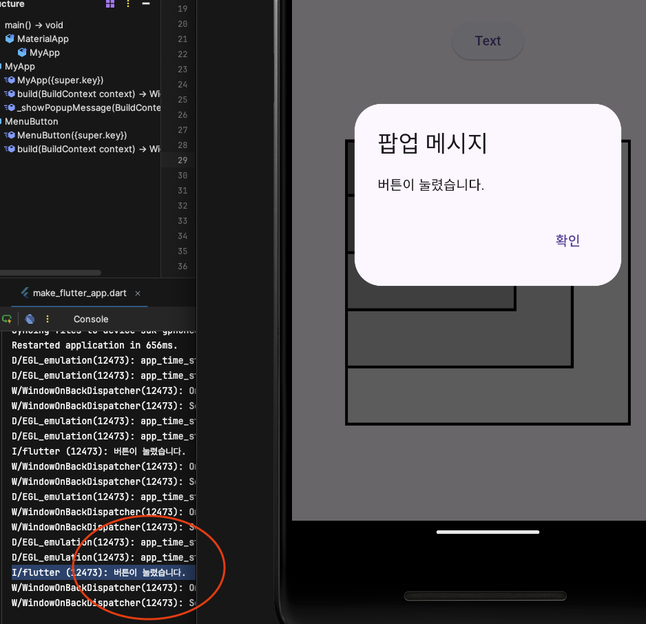

# AIFFEL Campus Online Code Peer Review Templete
- 코더 : 민혁
- 리뷰어 : 권오근


# PRT(Peer Review Template)
- [X]  **1. 주어진 문제를 해결하는 완성된 코드가 제출되었나요?**  

코드에서 요구하는 최종 결과물, 즉 Flutter 앱이 구현되었습니다.
요구사항에 맞게 앱 바, 버튼, 팝업 메시지, 그리고 스택 형태로 쌓인 정사각형 컨테이너들이 잘 구현되었습니다.    
     
- [X]  **2. 전체 코드에서 가장 핵심적이거나 가장 복잡하고 이해하기 어려운 부분에 작성된   
주석 또는 doc string을 보고 해당 코드가 잘 이해되었나요?**  

Stack 위젯 내부에서 for 반복문을 사용해 정사각형 컨테이너를 겹치도록 구현한 부분과    
팝업 메시지 기능 (_showPopupMessage)이 가장 중요하고 핵심적인 로직입니다.    
        
- [X]  **3. 에러가 난 부분을 디버깅하여 문제를 해결한 기록을 남겼거나
새로운 시도 또는 추가 실험을 수행해봤나요?**

디버깅 과정을 명시적으로 기록한 부분은 없지만,  
문제 해결을 위해 Container와 Stack의 정렬 문제를 다루고 있으며,  
팝업 메시지 기능을 추가하여 사용자의 피드백을 처리하는 부분이 인상적입니다.  
        
- [X]  **4. 회고를 잘 작성했나요?**


회고도 잘 작성했는 모습입니다.

- [X]  **5. 코드가 간결하고 효율적인가요?**

직관적이고 깔끔했습니다.


# 회고(참고 링크 및 코드 개선)
```
퀘스트가 쉬워서 그런지 다양한 실험을 하신것이 인상깊었습니다.  
저도 민혁님처럼 다양한 시도를 할걸 그랬어요.. ㅜ
  
```
