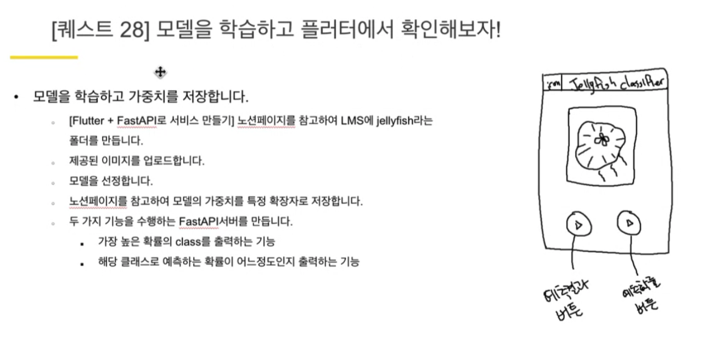
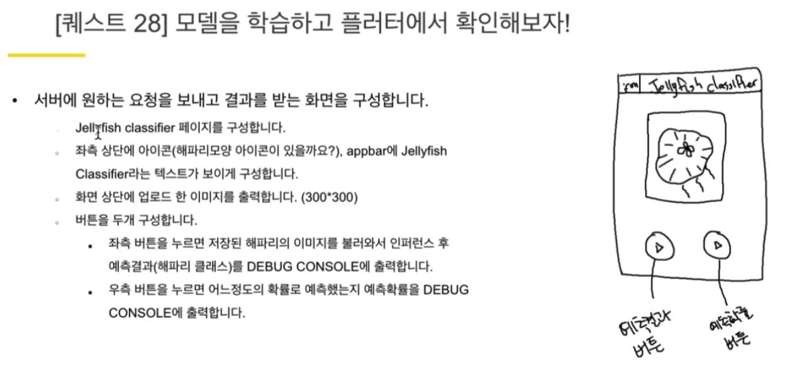
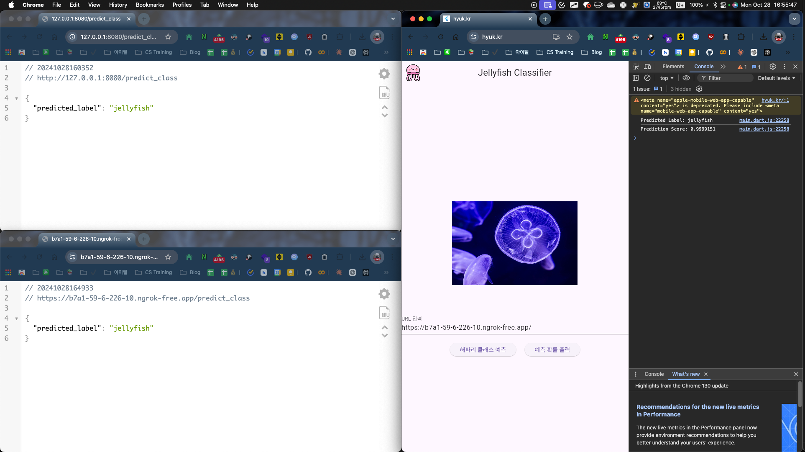
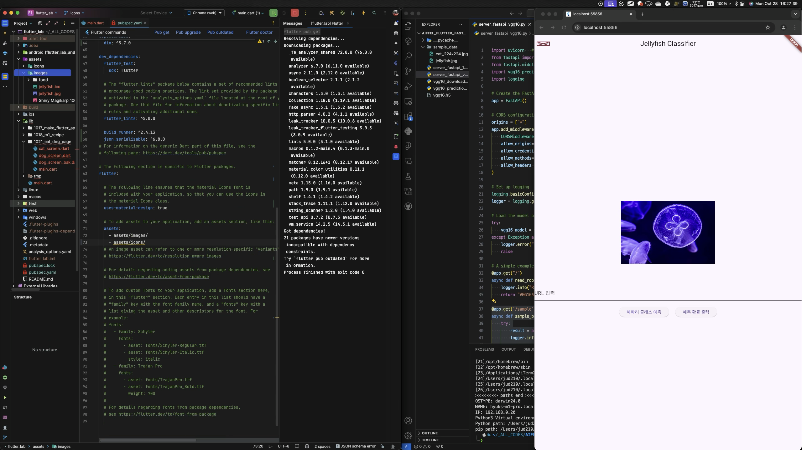
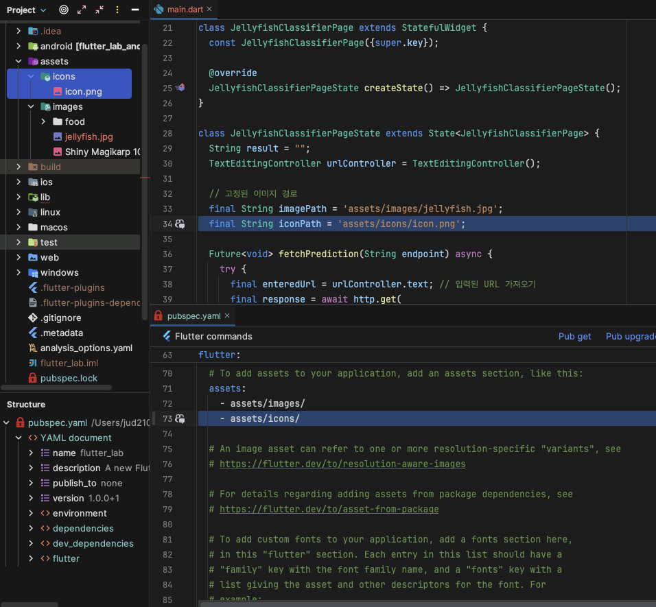

# 회고록

## 퀘스트 내용

## 퀘스트 결과

## 오류 해결 시도

### Android Studio 로딩 이슈

- 이슈: 아이콘 파일을 분명히 넣어뒀는데, 자꾸 인식이 안 됐음.
- 해결법: 그냥 안드로이드 스튜디오 껐다 켜니까 해결됨 😂

## 주절주절

- 시간이 촉박하여, 다른 모델을 사용해볼 엄두가 나질 않았다. 다행히도 퍼실님들 말씀처럼, 이미 예전에 제작해둔 가이드라인에서 약간씩만 손보면 되는 문제였어서 어떻게든 시간 이내로는 끝마칠 수 있었다.
- 내가 만약 Android Studio와 VSCode와 관련된 다양한 단축키, 그리고 온갖 터미널 명령어들을 커스터마이징하여 alias 등을 잘 활용하지 않았다면... 2시간 이내에는 절대 끝마치지 못했을 것 같다.
- GPT의 도움 없이는 FastAPI 파트 수정 및 Flutter 앱 파트 구현이 쉽지 않았다. 당장 뭘 어떻게 해야 할지는 알겠는데, 지금 그거 한땀한땀 하고 있을 새가 없지 않은가? 그래도 이제 어느정도 이해도가 확실히 생기니, GPT가 준 결과물이 뭘 의미하는지도 모르고 휘둘리지는 않게 되었다. 정말 GPT 없이는 못 살 것 같다ㅋㅋ 너무 편하다.